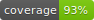

# dsbuntis

This package allows you to crawl DSB's "Mobile API" and parse Untis's HTML. 

# How to use this

Take a look at
[Accemus](https://github.com/Ampless/Accemus/blob/master/bin/accemus.dart).
